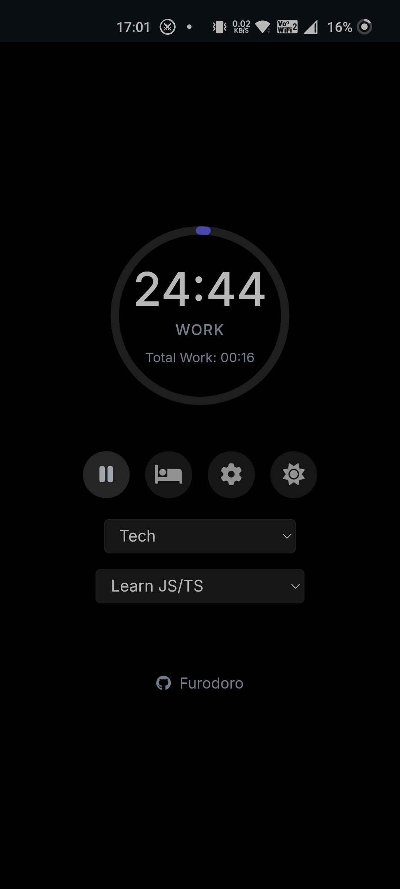
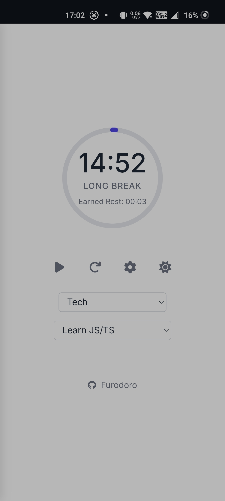
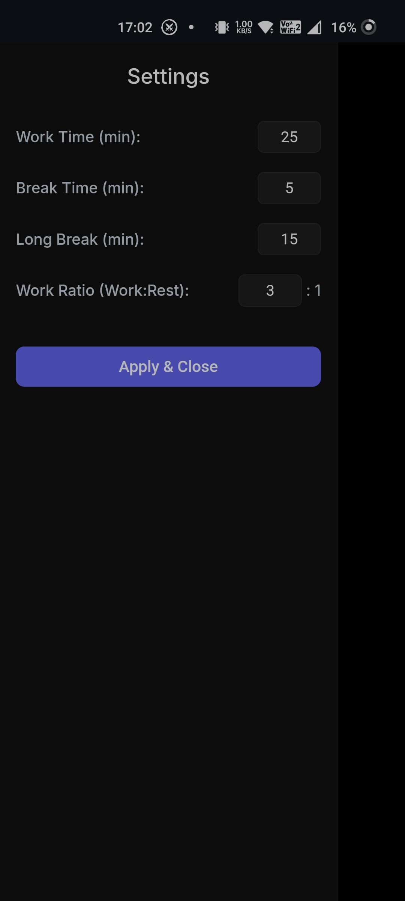

# Furodoro - Pomodoro/Flomodoro Timer with LifeUp Integration

A simple, clean Pomodoro timer web application designed to help you focus, with added integration for tracking completed sessions in the [LifeUp](https://github.com/Ayagikei/LifeUp) gamification app.

<table>
  <tr>
    <td align="center"></td>
    <td align="center"></td>
    <td align="center"></td>
  </tr>
</table>

## Features

*   **Classic Pomodoro Timer:** Standard work, short break, and long break cycles.
*   **Configurable Durations:** Easily adjust work, short break, and long break times via the settings panel.
*   **Work:Rest Ratio:** Configure how much break time you earn relative to your work time.
*   **Task Integration:**
    *   Fetches task categories from a local API (`http://localhost:13276/tasks_categories`).
    *   Fetches tasks based on the selected category (`http://localhost:13276/tasks`).
    *   Allows selecting a specific task to work on.
*   **LifeUp Integration:** Automatically sends completed Pomodoro cycles (total work time since last long break/reset) to the LifeUp app via its URL scheme when the **long break button is clicked** *and* a task is selected.
*   **Visual Progress:** Circular progress bar visually indicates time remaining.
*   **Mode Indicator:** Clearly shows whether you are in a "Work", "Break", or "Long Break" session.
*   **Stats Display:** Shows total work time accumulated (since last long break/reset) or earned rest time.
*   **Clean UI:** Simple interface built with HTML, CSS, and vanilla JavaScript.
*   **PWA Ready:** Includes a manifest and service worker registration for potential installation.
*   **(Optional) Dark Mode:** Basic dark mode support can be enabled (requires uncommenting theme button and potentially adding CSS variables).

## How to Use / Setup

1.  **Prerequisites:**
    *   You need the LifeUp app installed on your device if you want to use the integration feature.
    *   You need the companion local server LifeUp Cloud running (which provides the `/tasks_categories` and `/tasks` endpoints, e.g., at `http://localhost:13276`).
2.  **Serve the Files:** Serve the `index.html`, `style.css`, `script.js`, `apiService.js`, `manifest.json`, and `service-worker.js` files using a simple local web server. Many tools can do this, for example:
    *   Using Python: `python -m http.server`
    *   Using Node.js with `http-server`: `npx http-server`
3.  **Access:** Open your web browser and navigate to the local address provided by your server (e.g., `http://localhost:8000` or `http://localhost:8080`).
4.  **Select Task (Optional):** Choose a category and then a specific task from the dropdowns if you want the completed Pomodoro cycle to be logged against that task in LifeUp when you start a long break.
5.  **Start Timer:** Click the play button (<i class="fas fa-play"></i>) to begin a work session.
6.  **Take Short Breaks:** When a work session ends, click the main button (<i class="fas fa-pause"></i>) to start a short break. The timer will switch to the calculated break duration. Click the main button (<i class="fas fa-pause"></i>) again during a short break to interrupt it and resume work immediately.
7.  **Take Long Breaks & Log to LifeUp:** After completing one or more work/short break cycles, click the long break button (<i class="fas fa-bed"></i>).
    *   If a task was selected, the app will attempt to redirect to a `lifeup://` URL to log the total work time accumulated since the last long break/reset.
    *   The timer will then switch to the long break duration.
8.  **Adjust Settings:** Click the cog icon (<i class="fas fa-cog"></i>) to open the settings panel and customize timer durations.

## Technologies Used

*   HTML5
*   CSS3 (including CSS Variables / Custom Properties)
*   Vanilla JavaScript (ES6 Modules)
*   Font Awesome (for icons)
*   Google Fonts (Inter)

## Future Ideas

*   Add sound notifications for session completion.
*   Implement the theme toggle button.
*   Persist selected task across sessions.
*   Add more robust error handling for API calls.
*   Improve PWA offline capabilities.

---

Feel free to contribute or modify!
